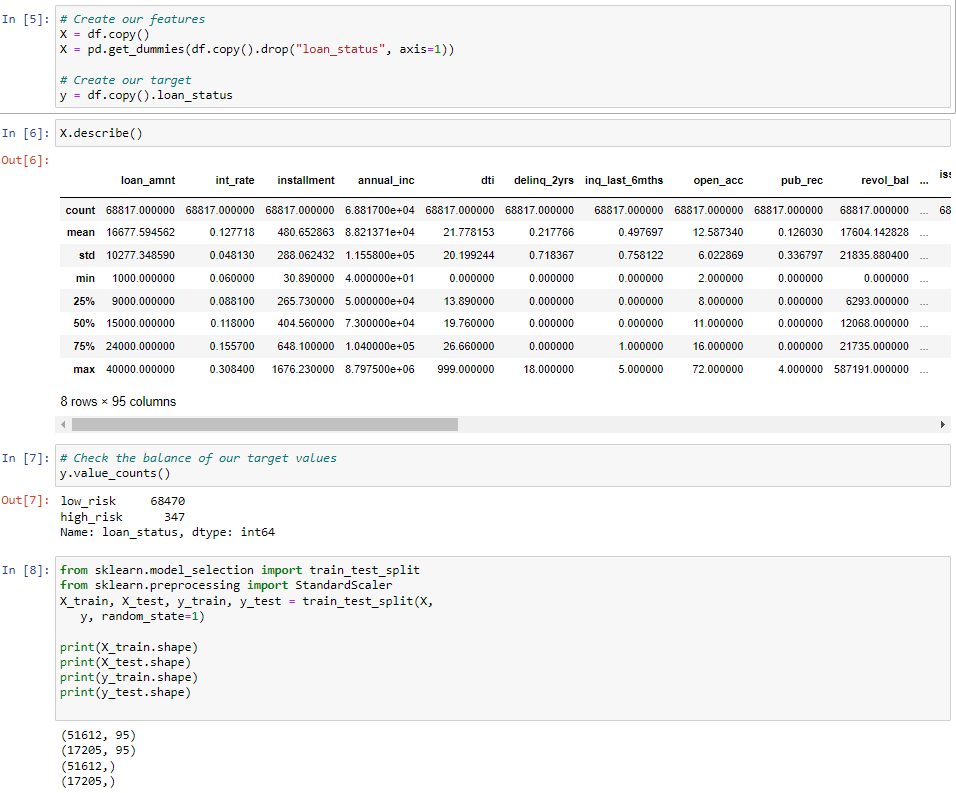
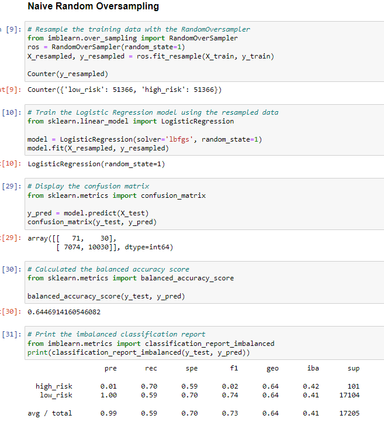
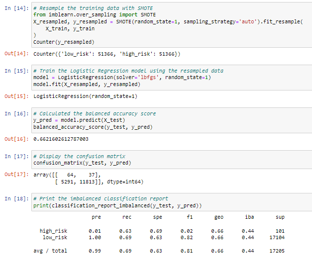
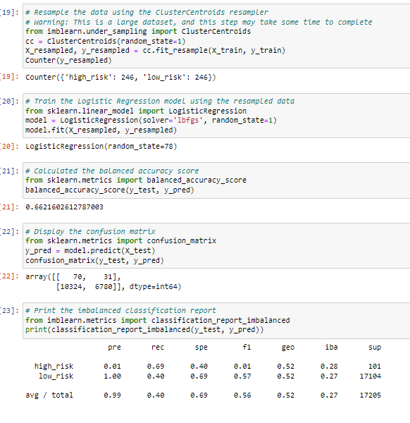
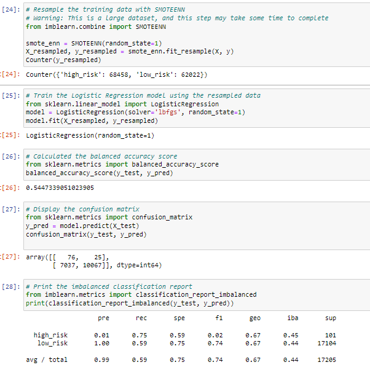
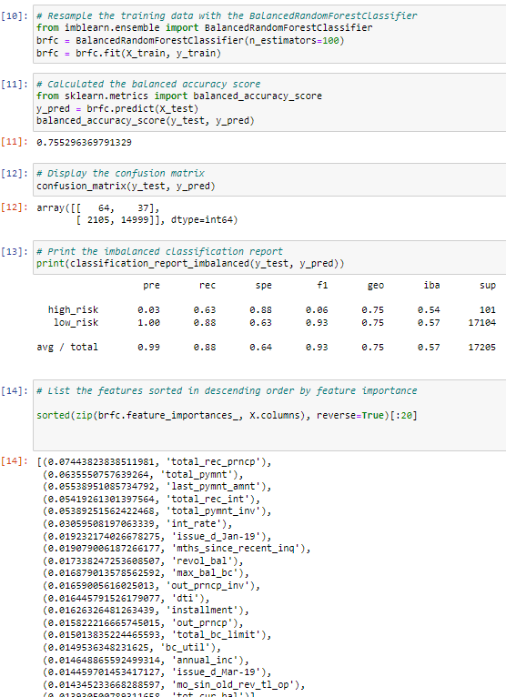
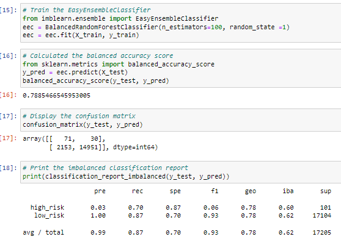

# Credit_Risk_Analysis

## Overview
In this project we will be working with Jill to do data preperation, statistical learning and machine learning. We will be breaking down a csv file containing information of credit card users and their fianacial status. We will be using imbalanced-learn and scikit-learn libraries to comeplete the analysis. 

## Results

We will have to split our data into Training and Testing. We will start by making a copy of our csv file and apply get_dummies for data manipulation. We calculate the high and low risk. 

We will use two diffrent methods to do Oversampling, first being Naive Random Oversampling and the second is Smote Oversampling

When we compare Naive and Smote we can see that our precision, recall, specificity, geometric mean, and index balanced accuracy are very close to each other. 

Next we introduce Undersampling, we will compare our finding to the oversampling and detrmin if there is much diffrence between the two types of algorithams.

We will combine both Over and Under sampling to see how our data compares. We will be using Smoteenn algorithams to test our data. 

Even with our data combined we can see that there is not much of a difference. Our precission rate stayed exactly the same between the two algorithams. We do see a slight increas in our recall, specificity, geo and index balanced accuracy. But not enough to determin that its the best fit for our data. 

To further test our data we can intoduce Ensemble Learners. We will use Balanced Random Classifier and Easy Ensemble AdaBoost Classifier. 

As we look at previous algorithams and compare it to AdaBoost we can see that some of our data starts to differ from the rest. 

# Summary
After testing all of our data and using multiple algorithams we can see that one that gives us the most clear answer is the AdaBoost Classifier. Our precision stayted exactly the same across all tests but the major difference happens for geometric mean and index balanced accuracy and thats why this would be the best algoritham to use for our data. 

